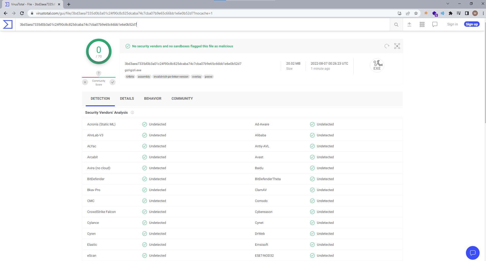

# Gizligizli

Gizli gizli means sneaky sneaky in Turkish. Thanks to [twitch](https://www.youtube.com/watch?v=42b6JGSbaAo&t=258s) for being a good naming inspiration :D 

Gizligizli hides shellcode inside PE icons using steganography and creates a PE that executes the hidden shellcode. 

All written in Python. 

*** This project is highly experimental, might require you to do some modifications in the code. Works on windows only ***

# Introduction

When you run `gizligizli.py`, 

- Given shellcode is embedded into an icon (Can be a custom icon)
- A PE is generated using pyinstaller with malicious icon

When you run `gizligizli.exe`(generated exe),

- Program finds the icon and unhides the shellcode from it
- Executes the shellcode


Example icons before and after embedding shellcode,

Original Icon              |  Shellcode Embedded Icon
:-------------------------:|:-------------------------:
    |   
   |   


Top left pixel holds the shellcode length. For example, if the shellcode length is 493, top left pixel holds the RGB value (255,238,0). 

Every byte in the shellcode is embedded into shellcode length many pixels.  They are embedded into R values. This is possible as each channel can have values between 0x00-0xff.

Virustotal results,



If defender starts detecting it, just change the icon simply :D 

Use a `48x48` image.


# Demo

https://www.youtube.com/watch?v=TnX_WaDD57A

[](https://www.youtube.com/watch?v=TnX_WaDD57A)


# Example run

Only works on windows now.

Install the dependencies,
```
python3 -m pip install -r requirements.txt
```

Run,
```
python3 gizligizli.py
```

# TODO

- Implement different ways to execute shellcode
- VM & Sandbox detection